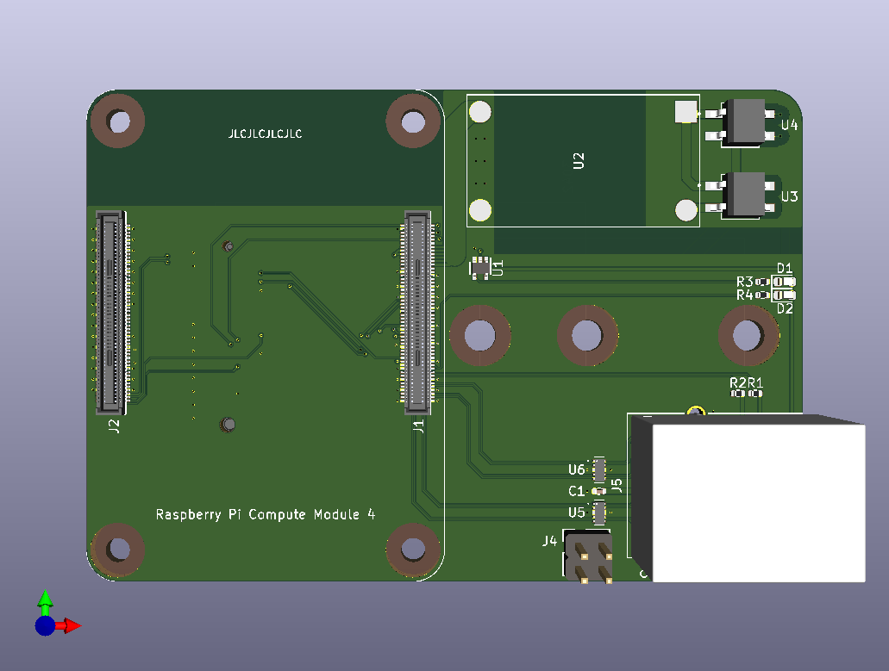

# SimplePi
A simple RPi CM4 carrier board with Ethernet and (hopefully) M.2 Key E interface.

I designed this extremely simple carrier board while learning PCB design. Please forgive me (and point it out) if you spot any weirdness.

The design files will be available when/if I get the correct paperworks.
